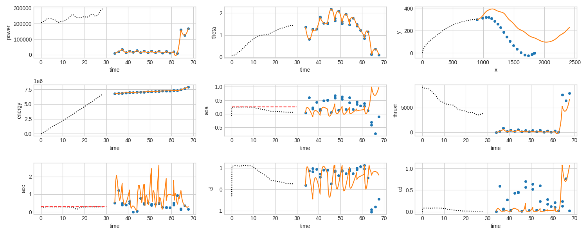

# The Dymos implementation of the eVTOL full mission(currently attempting descent)

The script to actually optimize the eVTOL using Dymos and OpenMDAO is available in `evtol_dymos_Mar3.py`.
We'll go through the run script and explain how the problem is setup.

## Front matter

This first part of the script just loads the default data needed for the given model.
There's not much to say about this, other than the fact that the input arguments, which were previously taken from the command-line, are now just hard-coded.
Since we're running this file as a script, and not part of an installed package, we add the `ode` directory to the python environment so we can import our Dynamics model.

```python
mport openmdao.api as om
import dymos as dm
import numpy as np

import sys

sys.path.insert(0, "../ode")
from evtol_dynamics_comp_vectorized import Dynamics as DynamicsVectorized

import verify_data

if __name__ == '__main__':
    input_arg_1 = 0.0

    input_arg_2 = 'ns'

    # Some specifications
    prop_rad = 0.75
    wing_S = 9.
    wing_span = 6.
    num_blades = 3.
    blade_chord = 0.1
    num_props = 8

    # User-specified input dictionary
    input_dict = {'T_guess': 9.8 * 725 * 1.2,  # initial thrust guess
                  'x_dot_initial': 0.,  # initial horizontal speed
                  'y_dot_initial': 0.01,  # initial vertical speed
                  'y_initial': 0.01,  # initial vertical displacement
                  'A_disk': np.pi * prop_rad ** 2 * num_props,  # total propeller disk area
                  'AR': wing_span ** 2 / (0.5 * wing_S),  # aspect ratio of each wing
                  'e': 0.68,  # span efficiency factor of each wing
                  't_over_c': 0.12,  # airfoil thickness-to-chord ratio
                  'S': wing_S,  # total wing reference area
                  'CD0': 0.35 / wing_S,  # coefficient of drag of the fuselage, gear, etc.
                  'm': 725.,  # mass of aircraft
                  'a0': 5.9,  # airfoil lift-curve slope
                  'alpha_stall': 15. / 180. * np.pi,  # wing stall angle
                  'rho': 1.225,  # air density
                  'induced_velocity_factor': int(input_arg_1) / 100.,  # induced-velocity factor
                  'stall_option': input_arg_2,  # stall option: 's' allows stall, 'ns' does not
                  'R': prop_rad,  # propeller radius
                  'solidity': num_blades * blade_chord / np.pi / prop_rad,  # solidity
                  'omega': 136. / prop_rad,  # angular rotation rate
                  'prop_CD0': 0.012,  # CD0 for prop profile power
                  'k_elec': 0.9,  # electrical and mechanical losses factor
                  'k_ind': 1.2,  # induced-losses factor
                  'nB': num_blades,  # number of blades per propeller
                  'bc': blade_chord,  # representative blade chord
                  'n_props': num_props  # number of propellers
                  }
    #####################################
    # New input dictionary for descent  #
    #####################################

    # User-specified input dictionary
    input_dict_d = {'T_guess': 9.8 * 725 * 0.9,  # initial thrust guess
                  'x_dot_initial': 67.,  # initial horizontal speed
                  'y_dot_initial': 0.,  # initial vertical speed
                  'y_initial': 305,  # initial vertical displacement
                  'A_disk': np.pi * prop_rad ** 2 * num_props,  # total propeller disk area
                  'AR': wing_span ** 2 / (0.5 * wing_S),  # aspect ratio of each wing
                  'e': 0.68,  # span efficiency factor of each wing
                  't_over_c': 0.12,  # airfoil thickness-to-chord ratio
                  'S': wing_S,  # total wing reference area
                  'CD0': 0.35 / wing_S,  # coefficient of drag of the fuselage, gear, etc.
                  'm': 715.,  # mass of aircraft
                  'a0': 5.9,  # airfoil lift-curve slope
                  'alpha_stall': 15. / 180. * np.pi,  # wing stall angle
                  'rho': 1.225,  # air density
                  'induced_velocity_factor': int(input_arg_1) / 100.,  # induced-velocity factor
                  'stall_option': input_arg_2,  # stall option: 's' allows stall, 'ns' does not
                  'R': prop_rad,  # propeller ra
    p.set_val('traj.descent.states:x', descent.interpolate(ys=[900, 1800], nodes='state_input'))dius
                  'solidity': num_blades * blade_chord / np.pi / prop_rad,  # solidity
                  'omega': 136. / prop_rad,  # angular rotation rate
                  'prop_CD0': 0.012,  # CD0 for prop profile power
                  'k_elec': 0.9,  # electrical and mechanical losses factor
                  'k_ind': 1.2,  # induced-losses factor
                  'nB': num_blades,  # number of blades per propeller
                  'bc': blade_chord,  # representative blade chord
                  'n_props': num_props  # number of propellers
                  }
    #####################################
    #####################################

              
```

## Setting Up the OpenMDAO Problem

The next step is to setup an OpenMDAO problem.
Unlike typical OpenMDAO problems, we'll be using some Dymos-based components in this one (a `Trajectory` and a `Phase`).

A `Trajectory` is just a special OpenMDAO group used by Dymos to contain `Phases`.
A `Phase` in Dymos is a portion of the trajectory broken out in time.
In each Phase we could, if we wished, use a different ODE to model the flight.
We can also impose different boundary and path constraints on each Phase.
For this particular problem, the same ODE is used to model the entirety of the trajectory, and there are no intermediate boundary constraints, so a single phase should be fine.

In instantiating the Phase, three arguments are used.  The transcription (which we'll discuss next), the ode_class, and arguments with which the ODE is initialized.
The `ode_class` is simply the vectorized `Dynamics` Dymos model we created.
All ODE's are expected to have `num_nodes` as an initialization argument, but the `Dynamics` class also takes an argument named `input_dict`.
The `ode_init_kwarg` option is used to specify which additional arguments (aside from `num_nodes`) should be provided when the ODE is instantiated, as well as the corresponding value.

The transcription is a bit more technical, but in optimal control, the `transcription` dictates how the problem of finding a _continuous_ control profile is transcribed into a _discrete_ nonlinear optimization problem which can be solved by an off-the-shelf optimizer.
The two main transciptions used by Dymos are the Radau Pseudospectral Method and high-order Gauss-Lobatto collocation.
Dymos was constructed so that we can simply provide either one and get similar behavior.
For this problem, we found that GaussLobatto seemed to provide better performance.

The number of segments in the transcription are the number of pieces into which the time domain is divided.
On each of these pieces, the state time histories are modeled by a polynomial of the given `order`.
As the math works out, the controls on each segment as polynomials of an order one less than those of the states.
So in this case, on each segment our control variables (`theta` and `power`) will be modeled as quadratic polynomials.


The option `solve_segments` is used to tell Dymos that a nonlinear solver, as opposed to the optimizer, should be responsible for eliminating the residuals of the collocation defects.
Put another way, if we use `solve_segments`, the optimizer only sees each iteration as a propagated trajectory (a shooting method).
Using `solve_segments` also allows us to simulate the trajectory with the given control inputs by using `run_model`.
We used this capability when debugging the ODE.


Finally, the option `compressed` dictates whether Dymos specifies separate design variable values for the states and controls at each segment boundary.
If we use _compressed_ transcription, then the value of a control (for instance) is shared at a segment boundary...continuity is guaranteed.
On the other hand, setting this option to `False` means that we use two  separate values of the state or control: one for the end of the left side segment, and one for the beginning of the right-side segment.
Constraints are then imposed within the optimizer to ensure that, upon a successful optimization, those two values are identical.
Continuity of state and control values is achieved in the optimized solution, but during the search the segments are free to be discontinuous.
This can help the optimizer exit local extrema in some situations.
For Dymos, using a non-compressed transcription with `solve_segments=True` also means that the solver propagates each segment individually from a presumed initial state value.
In this way, we can toggle whether  Dymos uses single or multiple-shooting when `solve_segments` is used.
For the sake of getting a fully propagated trajectory with `run_model` when using `solve_segments`, we should use `compressed=True`.
Otherwise performance is sometimes better when `compressed=False`.

```python
    p = om.Problem()

    traj = dm.Trajectory()
    p.model.add_subsystem('traj', traj)
    #####################################################
    # Phase-1 declaration 'Ascent'                      #
    #####################################################
    ascent = dm.Phase(transcription=dm.GaussLobatto(num_segments=10, order=3, solve_segments=False,
                                                   compressed=False),
                     ode_class=Dynamics,
                     ode_init_kwargs={'input_dict': input_dict})  ##the vectorized dynamics

    traj.add_phase('ascent', ascent)
    
    
    #Similiarly we define the Descent phase
    
    #########################################################
    # Phase-2     CHANGES MADE                              #
    #########################################################
    descent = dm.Phase(transcription=dm.GaussLobatto(num_segments=10, order=3, solve_segments=False,
                                                   compressed=False),
                     ode_class=Dynamics,
                     ode_init_kwargs={'input_dict': input_dict_d})  ## The initialization dictionary is changed here.

    traj.add_phase('descent', descent)
```
## Prescribing the Time, State, and Controls

Now the interesting part.

First, the time options.
For this phase, the time options are fairly basic.
We have a known initial time of the phase, and so using `fix_initial` will remove the `t_initial` variable in the phase as a design variable for the optimizer.
It will simply use whatever value we provide it.
The duration of the Phase is unknown - we don't know how long it should take for the aircraft to reach its final state target.
We'll bound the duration by what seems like a reasonable amount instead.
The `duration_ref` is used to scale the duration of the phase from the optimizer's perspective.
In this case, we're telling it to treat 30 seconds as one unit of time.

```python
    phase.set_time_options(fix_initial=True, duration_bounds=(5, 60), duration_ref=30)
```

We need to tell Dymos what variables are our _states_ (the quantities integrated over time), and which variables are our time-varying _controls_ or static _parameters_.
By decomposing the problem into first-order differential equations, we have a total of five states:
* the horizontal position (x)
* the vertical position/altitude (y)
* the horizontal velocity (vx)
* the vertical velocity (vy)
* the overall energy used - power integrated over time (energy)

These states are starting at known initial values and being propagated over the time duration of the phase.
That is, their initial values should be fixed to whatever we specify as our initial guess - this is what `fix_initial=True` is doing.
Alternatively, we could impose nonlinear boundary constraints on their initial values to achieve a similar result.
In this case, later we're going to impose boundary constraints on their final values to make the vehicle go where we want.

The `rate_source` option specifies which output of the ODE is providing the time derivative of the state.
In general, we could tell Dymos that the rate_source is the name of another state or control (i.e. the rate_source of `x` is `vx`), but we're keeping the ODE model as similar to the original as we can here.

Options `ref0` and `ref` are standard OpenMDAO design variable options.
The tell the optimizer, "these are the values of the design variable that should be treated as 0 and 1 - scale it accordingly".
The `defect_ref` tell Dymos how to scale the _defect_ constraints.
A higher scaler (or lower ref) increases the magnitude of the constraint seen by the optimizer. and the optimizer will have to work harder to satisfy and deviation from the desired value.

```python
    ascent.set_time_options(fix_initial=True, duration_bounds=(5, 60), duration_ref=30)
    ascent.add_state('x', fix_initial=True, rate_source='x_dot', ref0=0, ref=900, defect_ref=100)
    ascent.add_state('y', fix_initial=True, rate_source='y_dot', ref0=0, ref=300, defect_ref=300)
    ascent.add_state('vx', fix_initial=True, rate_source='a_x', ref0=0, ref=10)
    ascent.add_state('vy', fix_initial=True, rate_source='a_y', ref0=0, ref=10)
    ascent.add_state('energy', fix_initial=True, rate_source='energy_dot', ref0=0, ref=1E7, defect_ref=1E5)


    #for adding states for descent phase.
    descent.set_time_options(initial_bounds=(.5, 100), duration_bounds=(.5, 100),
    duration_ref=100, units='s')
    descent.add_state('x', fix_initial=True, fix_final=False, rate_source='x_dot') #, ref0=0, ref=900, defect_ref=100
    descent.add_state('y', fix_initial=True, fix_final=True, rate_source='y_dot') #, ref0=0, ref=300, defect_ref=300
    descent.add_state('vx', fix_initial=True, fix_final=True, rate_source='a_x')#, ref0=0, ref=10)
    descent.add_state('vy', fix_initial=True, fix_final=True, rate_source='a_y')#, ref0=0, ref=10)
    descent.add_state('energy', fix_initial=False, fix_final=False, rate_source='energy_dot', ref0=1900, ref=1E7, defect_ref=1E3) 
```

In this case, we have no parameters but we do have two time-varying controls: `theta` and `power`.
By now the scaling and bounds should be pretty self-explanatory.
You may be wondering what `rate_continuity` is doing.
Remember, the controls are quadratic for our 3rd order segments.
If we dictate that their continuous in their time-derivatives at the segment bounds, that can introduce unwanted "ringing" or oscillatory behavior in them.
This is definitely a setting that you might want to play around with, because often rate_continuity is helpful.  
In our problem, we noticed that it didn't seem to be helping so we disabled it.

```python
    ascent.add_control('power', lower=1e3, upper=311000, ref0=1e3, ref=311000, rate_continuity=False)
    ascent.add_control('theta', lower=0., upper=3 * np.pi / 4, ref0=0, ref=3 * np.pi / 4,
                      rate_continuity=False)
                      
    # for descent phase
    descent.add_control('power', lower=1e3, upper=311000, ref0=1e3, ref=311000, rate_continuity=False)
    descent.add_control('theta', lower=0., upper=3 * np.pi / 4, ref0=0, ref=3 * np.pi / 4,
                      rate_continuity=False)
    
    
```

## Adding Timeseries Outputs

Timeseries output is the primary way of getting data out of Dymos.
It provides contiguous-in-time values of times, states, controls, and parameters, as well as the objective and any constraints imposed.
In our case, we also want to plot the lift and drag coefficients for comparison against the original solution.
Since they're not used for constraints and are just outputs of the ODE, we have to explicitly add them to the timeseries output.

```python
    ascent.add_timeseries_output(['CL', 'CD'])
    #for descent
    descent.add_timeseries_output(['CL','CD'])
```

## The Objective and Constraints

In Dymos, objectives are generally prescribed at the `initial` or `final` time of a phase.
The Phase `add_objective` method is basically just a convenience method that lets you more easily prescribe the objective for OpenMDAO.

```python
    # Objective
    descent.add_objective('energy', loc='final', ref=1E7)
```

Boundary constraints can be appleid to either the `initial` or `final` time of a phase.
Here we're using three of them to constrain the final state of the aircraft.
One option you might want to explore is using the `linear=True` flag here.
When not using `solve_segments`, the final state values are design variables for the implicit trajectory optimization.
Therefore, any constraints imposed on those final values can be treated as linear constraints.

```python
    # Boundary Constraints
    #for ascent 
    ascent.add_boundary_constraint('y', loc='final', lower=305,
                                  ref=100)  # Constraint for the final vertical displacement
    ascent.add_boundary_constraint('x', loc='final', equals=900,
                                  ref=100)  # Constraint for the final horizontal displacement
    ascent.add_boundary_constraint('x_dot', loc='final', equals=67.,
                                  ref=100)  # Constraint for the final horizontal speed
    #for descent
    descent.add_boundary_constraint('y', loc='final', lower=1,
                                  ref=100)  # Constraint for the final vertical displacement
    descent.add_boundary_constraint('x', loc='final', equals=1800,
                                  ref=100)  # Constraint for the final horizontal displacement
    descent.add_boundary_constraint('x_dot', loc='final', equals=1.,
                                  ref=100)  # Constraint for the final horizontal speed

```

We've replaced the KS-constrained quantities in the original implementation with path constraints.
There are applied at each node in the transcription.
These can be used to impose practical constraints (such as altitude or acceleration), or to keep the solution away from singularities or regions where the models are invalid (such as setting a lower bound on thrust and bounding the angle of attack).

```python
    # Path Constraints
    ascent.add_path_constraint('y', lower=0., upper=305,
                              ref=300)  # Constraint for the minimum vertical displacement
    ascent.add_path_constraint('acc', upper=0.3,
                              ref=1.0)  # Constraint for the acceleration magnitude
    ascent.add_path_constraint('aoa', lower=-np.radians(15), upper=np.radians(15), ref0=-np.radians(15),
                              ref=np.radians(15))  # Constraint for the angle of attack
    ascent.add_path_constraint('thrust', lower=10, ref0=10,
                              ref=100)  # Constraint for the thrust magnitude
    #for descent
    descent.add_path_constraint('y', lower=0.1, upper=305,
                              ref=300)  # Constraint for the minimum vertical displacement
    descent.add_path_constraint('acc', upper=0.01,
                              ref=1.0)  # Constraint for the acceleration magnitude
    descent.add_path_constraint('aoa', lower=-np.radians(15), upper=np.radians(15), ref0=-np.radians(15),
                              ref=np.radians(15))  # Constraint for the angle of attack
    descent.add_path_constraint('thrust', lower=-10, ref0=10,
                              ref=100)  # Constraint for the thrust magnitude
```

## Specifying the Driver

Here we're using SNOPT to optimize the problem,
In the original proposal, the user asked why it seemed to perform so much better than SLSQP.
Unfortunately, it's just far more capable.

Development of high-quality, sparse-aware optimizers takes years of work.
Of the options freely available, IPOPT tends to be nearly on par with SNOPT for use in Dymos.
For this particular problem it settles in around the same objective (7.896831E-01).
Loosening the convergence tolerance a bit makes it converge fairly quickly.
The settings tried for IPOPT are included below, but commented out, for users who would like to experiment with it.

The `driver.declare_coloring` call below is key to the performance of Dymos.
Despite the fact that we're using an ODE with dense partials, a significant speedup can be achieved by invoking OpenMDAO's derivative coloring.
This can drastically reduce the time needed to optimize problems, and even more so if the ODE is written with sparse partials.

```python
    # # Setup the driver
    p.driver = om.pyOptSparseDriver()

    # p.driver.options['optimizer'] = 'SNOPT'
    # p.driver.opt_settings['Major optimality tolerance'] = 1e-4
    # p.driver.opt_settings['Major feasibility tolerance'] = 1e-6
    # p.driver.opt_settings['Major iterations limit'] = 1000
    # p.driver.opt_settings['Minor iterations limit'] = 100_000_000
    # p.driver.opt_settings['iSumm'] = 6

    p.driver.options['optimizer'] = 'IPOPT'
    p.driver.opt_settings['max_iter'] = 1000
    p.driver.opt_settings['alpha_for_y'] = 'safer-min-dual-infeas'
    p.driver.opt_settings['print_level'] = 5
    p.driver.opt_settings['nlp_scaling_method'] = 'gradient-based'
    p.driver.opt_settings['tol'] = 5.0E-5

    p.driver.declare_coloring(tol=1.0E-8)
```

## Completing Setup


```python
   

    p.setup()
```

## Assigning initial values

Dymos generally requires a reasonable initial guess for time, states, and controls.
When providing guesses for states and controls, it's good to provide a guess of the entire time history.
The problem is, we don't generally know how many nodes at which we need to specify values for the states and controls.
That's a function of the transcription "grid" - the number of segments and their spacing.
Furthermore, nodes are not evenly distributed.
The `interpolate` method of Phase lets us specify a time history of values that Dymos will interoplate to the correct points.
For the states below, we only specify two values (`ys`).
For these, Dymos will linearly interpolate from the first value to the second value across the entire phase.
Make sure to keep in mine, if we marked any states as using `fix_iitial` or `fix_final`, Dymos will be forced to remove the initial or final values of those states as design variables.

We choose to treat the guess for power a bit differently.
For that, we just guess a value of 200000 for the entirety of the Phase.

Lastly, when using `interpolate`, make sure to specify the correct nodes (`state_input` for states, and `control_input` for controls).

We repeat similiar initialization for the descent phase too.
```python
    # Set Initial Values for ascent Phase
    p.set_val('traj.ascent.t_initial', 0.0)
    p.set_val('traj.ascent.t_duration', 30)
    p.set_val('traj.ascent.states:x', ascent.interpolate(ys=[0, 900], nodes='state_input'))
    p.set_val('traj.ascent.states:y', ascent.interpolate(ys=[0.01, 300], nodes='state_input'))
    p.set_val('traj.ascent.states:vx', ascent.interpolate(ys=[0, 60], nodes='state_input'))
    p.set_val('traj.ascent.states:vy', ascent.interpolate(ys=[0.01, 10], nodes='state_input'))
    p.set_val('traj.ascent.states:energy', ascent.interpolate(ys=[0, 1E7], nodes='state_input'))

    p.set_val('traj.ascent.controls:power', ascent.interpolate(xs=np.linspace(0, 28.368, 500),
                                                              ys=verify_data.powers.ravel(),
                                                              nodes='control_input'))
    p.set_val('traj.ascent.controls:theta', ascent.interpolate(xs=np.linspace(0, 28.368, 500),
                                                              ys=verify_data.thetas.ravel(),
                                                              nodes='control_input'))

    p.set_val('traj.ascent.controls:power', 200000.0)
    p.set_val('traj.ascent.controls:theta', ascent.interpolate(ys=[0.001, np.radians(85)], nodes='control_input'))


    ##################
    # CHANGES MADE   #
    ##################

    # Set Initial Values for descent Phase 
    p.set_val('traj.descent.t_initial', 30.0) # initial time is set to the end of the ascent phase
    p.set_val('traj.descent.t_duration', 30) #the duration is set to 30s
    p.set_val('traj.descent.states:x', descent.interpolate(ys=[900, 1800], nodes='state_input')) # the descent trajectory interpolated in x
    p.set_val('traj.descent.states:y', descent.interpolate(ys=[300, 0.01], nodes='state_input')) # the descent trajectory interpolated in y
    p.set_val('traj.descent.states:vx', descent.interpolate(ys=[60, 0], nodes='state_input')) # The x direction velocity interpolation
    p.set_val('traj.descent.states:vy', descent.interpolate(ys=[10, 0.01], nodes='state_input')) # the y direction velocity interpolation
    p.set_val('traj.descent.states:energy', descent.interpolate(ys=[1E7, 0 ], nodes='state_input')) # the engery used

    p.set_val('traj.descent.controls:power', descent.interpolate(xs=np.linspace(28.368, 2*28.368, 500),
                                                              ys=verify_data.powers.ravel(),
                                                              nodes='control_input'))
    p.set_val('traj.descent.controls:theta', descent.interpolate(xs=np.linspace(28.368, 2*28.368, 500),
                                                              ys=verify_data.thetas.ravel(),
                                                              nodes='control_input'))

    p.set_val('traj.descent.controls:power', 200000.0)
    p.set_val('traj.descent.controls:theta', descent.interpolate(ys=[0.001,-np.radians(85) ], nodes='control_input')) # the control theta 

    dm.run_problem(p, run_driver=True, simulate=True)
```

If you have more than two values of a state or control to interpolate through, we could interpolate it by providing corresponding `xs`.
For instance, to provide the user's original solution as the initial guess:

```python
    p.set_val('traj.phase0.controls:power', phase.interpolate(xs=np.linspace(0, 28.368, 500),
                                                              ys=verify_data.powers.ravel(),
                                                              nodes='control_input'))
    p.set_val('traj.phase0.controls:theta', phase.interpolate(xs=np.linspace(0, 28.368, 500),
                                                              ys=verify_data.thetas.ravel(),
                                                              nodes='control_input'))
```
## Results
```python
iter    objective    inf_pr   inf_du lg(mu)  ||d||  lg(rg) alpha_du alpha_pr  ls
1000  7.8968311e-01 9.69e+01 9.57e+04   2.4 2.32e+02    -  4.53e-02 2.49e-05h 12

Number of Iterations....: 1000

                                   (scaled)                 (unscaled)
Objective...............:   7.8968311302093452e-01    7.8968311302093452e-01
Dual infeasibility......:   9.5694593664265994e+04    9.5694593664265994e+04
Constraint violation....:   2.0763857342817662e+00    9.6882655852838070e+01
Variable bound violation:   0.0000000000000000e+00    0.0000000000000000e+00
Complementarity.........:   1.2451426374503422e+10    1.2451426374503422e+10
Overall NLP error.......:   7.5729247159777546e+08    1.2451426374503422e+10


Number of objective function evaluations             = 1914
Number of objective gradient evaluations             = 834
Number of equality constraint evaluations            = 4065
Number of inequality constraint evaluations          = 1875
Number of equality constraint Jacobian evaluations   = 1041
Number of inequality constraint Jacobian evaluations = 1041
Number of Lagrangian Hessian evaluations             = 0
Total seconds in IPOPT                               = 403.996

EXIT: Maximum Number of Iterations Exceeded.


Optimization Problem -- Optimization using pyOpt_sparse
================================================================================
    Objective Function: _objfunc

    Solution: 
--------------------------------------------------------------------------------
    Total Time:                  404.0158
       User Objective Time :      65.8949
       User Sensitivity Time :    86.4204
       Interface Time :           13.2520
       Opt Solver Time:          238.4485
    Calls to Objective Function :    4037
    Calls to Sens Function :         1016


   Objectives
      Index  Name                                                      Value
          0  traj.phases.descent.indep_states.states:energy     7.896831E-01
```
## Running the problem

Finally, right!?!

To solve the optimal control problem, we could call `p.run_driver` and use the standard OpenMDAO way.
Dymos supports its own `run_problem` function that adds a bit of functionality to the standard OpenMDAO method.
Here, we're informing it to run the driver (the default behavior), but also simulate the ODE with the control history determined by the optimization.
It also adds recorders to the problem and the simulation automatically.
* `dymos_solution.db` is the recording of the final optimized design point
* `dymos_simulation.db` is the recording of the simulated result.
Both can be interrogated with the same path names to find the elements of the time history of the trajectory.

```
    dm.run_problem(p, run_driver=True, simulate=True)
```

## Plotting the results
For plotting the results of this optimization use 
```
plot_results_copy.py
```
The results of the optimization are plotted below.
The Dymos solution is plotted with blue dots, while the simulated Dymos result is plotted with an orange line.
The reference solution, where available, is plotted with small black dots.

We found an objective of 6.68E8, compared to 6.74E8 for the nominal case.
There are some minor differences in the two solutions, but overall they're in pretty good agreement.

Note that the original implementation uses a KS-constraint to pose the path constraints.
This has the benefit of providing a single, scalar, differentiable constraint.
One downside of this approach is that the constraint is somewhat conservative.
While Dymos can closely ride the path constraint in the discrete solution, the KS constraint leaves a bit of margin, possibly buying some performance for the Dymos solution.
A downside of the Dymos approach is that, by riding the constraint so tightly, theres a possiblity that it is voilated at points between our discrete solution.
We can see this in the acceleration limit, where there is some overshooting of the acceleration in the middle of the trajectory.
In practice, if we want to mitigate this, we can add more segments or higher-order segments to the problem to increase the density of the nodes where the path constraint is enforced.




## Responses to original questions from the submission

> What are the advantages over the current implementation?

The dymos solution, as shown, takes roughly 30 seconds to solve, compared to something closer to an hour for the original implementation.
The downside is that the dymos solution is a bit sensitive.

> What all needs to be done to use this with the latest recommended versions of Python and OpenMDAO?

We were able to get the original version running by copying in the old BSpline code.

> I solved these problems with little difficulty with SNOPT, but I didn't have the same success with SciPy SLSQP, which is a problem for others who may want to use this code. What can I do to make these problems converge with SciPy SLSQP (or any other freely available optimizer that you recommend)?

We were able to get this problem to solve using SNOPT or IPOPT with pyOptSparse.
IPOPT is similar in capability to SNOPT. (both can account for sparsity and are generally more robust than SLSQP)
IPOPT can be compiled using only free resources.
Both SNOPT and IPOPT are, in our experience, far superior to SLSQP on larger problems.

> What are some poor practices that you observe, and what would you recommend instead and why?

**First, you should take advantage of OpenMDAO's use of units**
* never having to wonder about what units a component is expecting in a model
* the ability to set/get values in any units you wish
* scaling the optimization variables just by specifying them in different units

The lack of any units in this cases actually exposed some issues in Dymos that are being addrdssed, simply because I never considered someone not using units at all.

**Second, when using gradient-based optimization you should take care that your model has well defined derivatives.**
Any usage of an if-block in a `compute` method potentially introduces non-differentiable behavior.
Sometimes this is unavoidable, but sometimes it's better to build a bridging function to smoothly connect two discontinuous portions of a model.
The lift coefficient, for instance, is computed conditionally.
There's even a note in the original implementation that complex-step doesn't seem to work right when alpha is close to zero, and this is the reason.

**A third issue is potential reparameterization.**
We found this model prone to encounter computational issues when used implicitly, particularly in this line:
```
    f = 1 + 0.5 * ((1 + Tc)**.5 - 1) + Tc / 4. / (2 + Tc)
```
As the problem is parameterized with power as an input, sometimes the thrust coefficient (Tc) would need to be negative to satisfy the inputs as given.
Occasionally we would stumble into a condition where `(1 + Tc)` is negative, which hinders the optimization.
While we didn't attempt it, it may be possible to provide thrust as a control variable and instead solve for power.
Then, being a design variable, thrust could be limited to positive values and avoid this pitfall.
Of course, similar issues may crop up when solving for power.

**Finally, vectorization makes a huge difference in run time.**

As originally posed, vectorization doesn't really make sense, but that's one of the reasons dymos exists.
There are challenges to vectorizing code - the conditional blocks in the original code need to make use of the `numpy.where` function, for instance.
Still, taking the solution time down from the order of one hour to one minute makes turning out analyses much easier.

